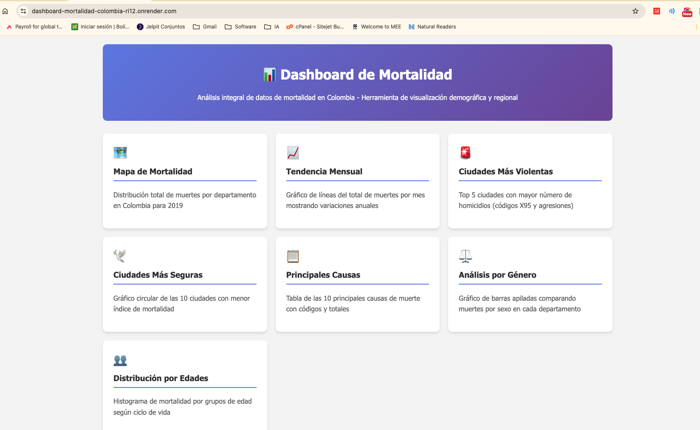
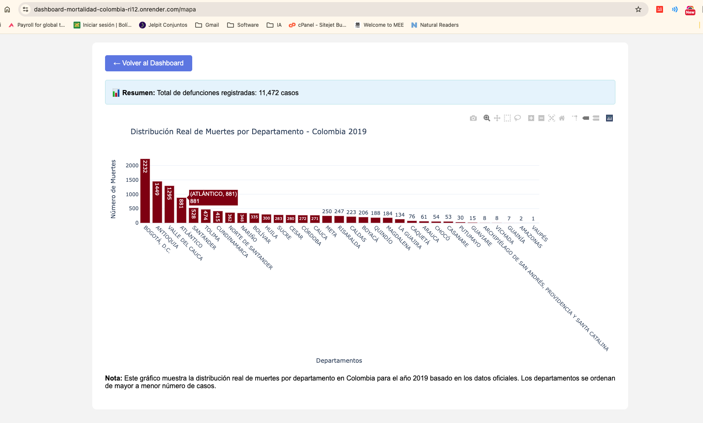
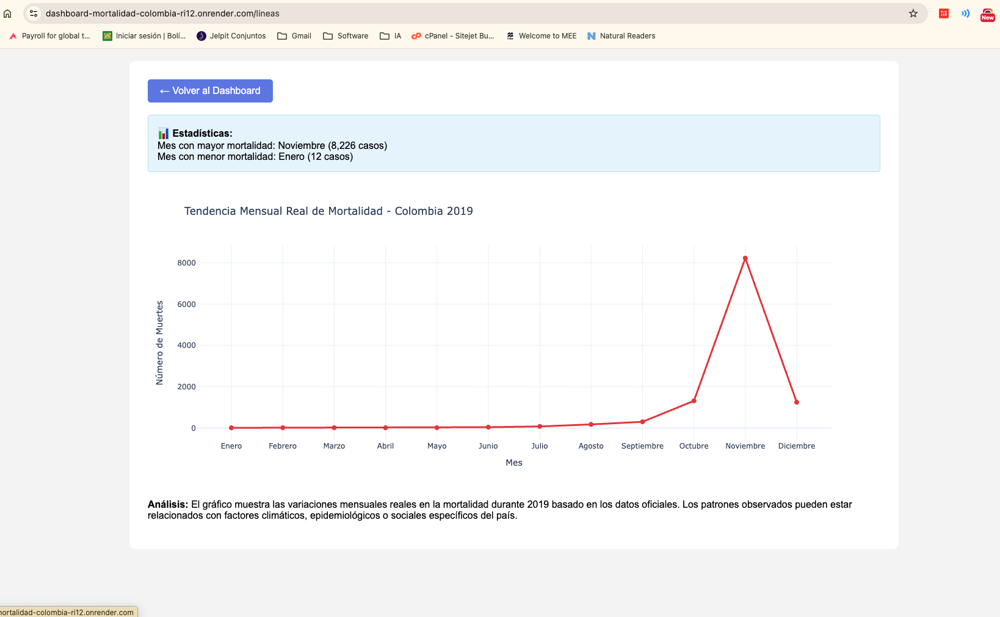
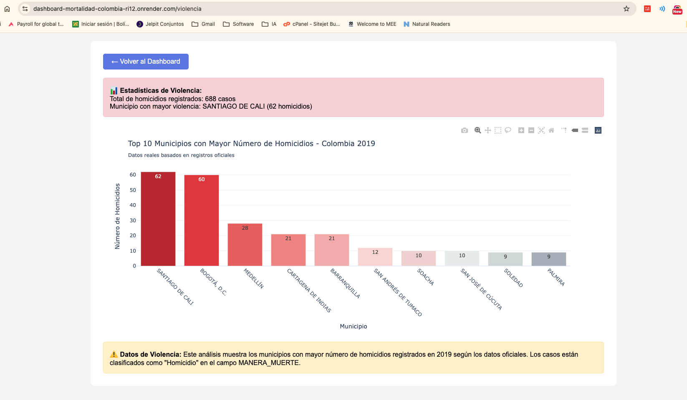
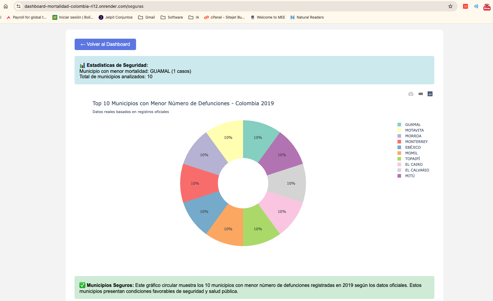
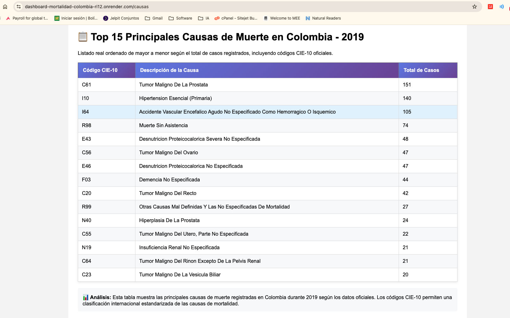
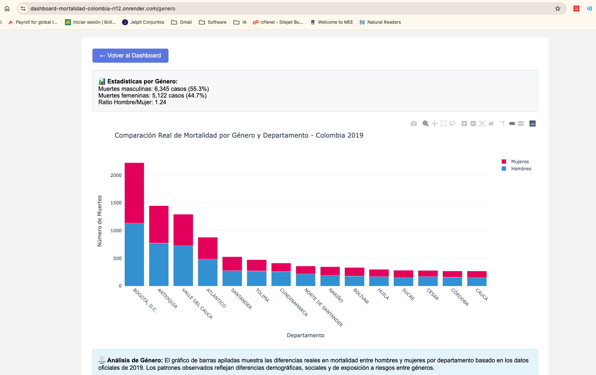
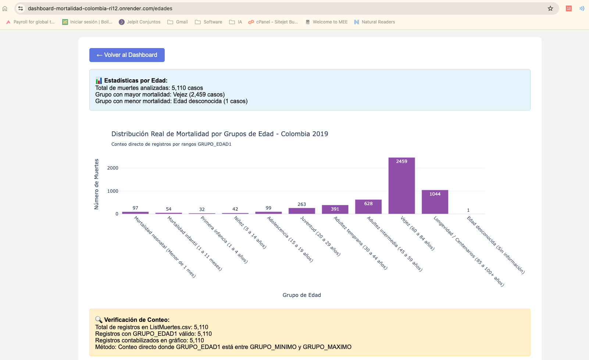

# Dashboard de Mortalidad - Colombia 2019

## 📋 Introducción del Proyecto

Este proyecto es un **dashboard interactivo de análisis de mortalidad** desarrollado en Flask que permite visualizar y analizar datos oficiales de defunciones en Colombia durante el año 2019. La aplicación web proporciona una interfaz intuitiva para explorar patrones demográficos, geográficos y temporales de la mortalidad en el país, facilitando la comprensión de tendencias epidemiológicas y sociales relevantes para la salud pública.

## 🎯 Objetivo

El dashboard busca **analizar y visualizar los patrones de mortalidad en Colombia** para:

- **Identificar tendencias temporales**: Analizar variaciones mensuales en la mortalidad durante 2019
- **Mapear distribución geográfica**: Visualizar la distribución de muertes por departamentos y municipios
- **Analizar causas principales**: Identificar las principales causas de muerte según códigos CIE-10
- **Estudiar patrones demográficos**: Examinar diferencias por género y grupos etarios
- **Evaluar seguridad ciudadana**: Identificar municipios con mayor y menor incidencia de violencia
- **Facilitar toma de decisiones**: Proporcionar información visual para políticas de salud pública

La aplicación transforma datos complejos en visualizaciones comprensibles que permiten a investigadores, funcionarios públicos y ciudadanos entender mejor la realidad de la mortalidad en Colombia.

## 🚀 Características

- **Mapa de Mortalidad**: Distribución de muertes por departamento
- **Tendencia Mensual**: Análisis temporal de la mortalidad a lo largo del año
- **Análisis de Violencia**: Identificación de municipios con mayor número de homicidios
- **Ciudades Seguras**: Municipios con menor índice de mortalidad
- **Principales Causas**: Ranking de las causas de muerte más frecuentes
- **Análisis por Género**: Comparación de mortalidad entre hombres y mujeres
- **Distribución por Edades**: Patrones de mortalidad por grupos etarios

## 📊 Tecnologías Utilizadas

- **Backend**: Flask (Python)
- **Visualización**: Plotly.js
- **Análisis de Datos**: Pandas, NumPy
- **Frontend**: HTML5, CSS3, JavaScript
- **Datos**: CSV (archivos de datos oficiales)

## 📁 Estructura del Proyecto

```
PythonWeb/
├── app.py                 # Aplicación principal Flask con todas las rutas y lógica
├── requirements.txt       # Dependencias del proyecto (Flask, pandas, plotly, numpy)
├── README.md             # Documentación completa del proyecto
├── .gitignore           # Archivos excluidos del control de versiones
├── venv/                # Entorno virtual de Python (no incluido en git)
├── __pycache__/         # Cache de Python (generado automáticamente)
└── data/                # Directorio de datos CSV oficiales
    ├── ListMuertes.csv  # Datos principales de defunciones 2019 (registro completo)
    ├── DiviPola.csv     # Códigos DANE de división político-administrativa
    ├── CodMuerte.csv    # Códigos CIE-10 internacionales de causas de muerte
    └── Grupos.csv       # Definición de grupos etarios y rangos de edad
```

### Descripción Detallada de Archivos

- **`app.py`**: Archivo principal que contiene toda la aplicación Flask, incluyendo:
  - Funciones de carga y procesamiento de datos CSV
  - 7 rutas principales para diferentes visualizaciones
  - Lógica de análisis estadístico y generación de gráficos
  - Templates HTML embebidos con estilos CSS

- **`data/`**: Contiene los datasets oficiales de mortalidad:
  - **ListMuertes.csv**: Dataset principal con registros individuales de defunciones
  - **DiviPola.csv**: Códigos geográficos para mapear departamentos y municipios
  - **CodMuerte.csv**: Clasificación internacional CIE-10 de causas de muerte
  - **Grupos.csv**: Categorización de grupos etarios para análisis demográfico

## 💻 Software y Herramientas Utilizadas

### Lenguajes de Programación
- **Python 3.7+**: Lenguaje principal del backend
- **HTML5**: Estructura de las páginas web
- **CSS3**: Estilos y diseño responsivo
- **JavaScript**: Interactividad del frontend (Plotly.js)

### Frameworks y Librerías
- **Flask**: Framework web ligero para Python
- **Pandas**: Manipulación y análisis de datos
- **NumPy**: Computación científica y arrays
- **Plotly**: Visualizaciones interactivas y gráficos

### Herramientas de Desarrollo
- **Git**: Control de versiones
- **pip**: Gestor de paquetes de Python
- **venv**: Entornos virtuales de Python

## 📋 Requisitos del Sistema

### Requisitos Mínimos
- **Sistema Operativo**: Windows 10, macOS 10.14+, o Linux Ubuntu 18.04+
- **Python**: Versión 3.7 o superior
- **RAM**: Mínimo 4GB (recomendado 8GB para datasets grandes)
- **Espacio en Disco**: 500MB libres
- **Navegador Web**: Chrome 80+, Firefox 75+, Safari 13+, o Edge 80+

### Dependencias de Python
```txt
Flask>=2.0.0          # Framework web
pandas>=1.3.0         # Análisis de datos
plotly>=5.0.0         # Visualizaciones interactivas
numpy>=1.21.0         # Computación científica
```

### Instalación de Dependencias
```bash
# Instalar todas las dependencias
pip install -r requirements.txt

# O instalar individualmente
pip install Flask pandas plotly numpy
```

## 🛠️ Instalación y Configuración

### Prerrequisitos

- Python 3.7 o superior
- pip (gestor de paquetes de Python)

### Pasos de Instalación

1. **Clonar el repositorio**
   ```bash
   git clone https://github.com/tu-usuario/dashboard-mortalidad-colombia.git
   cd dashboard-mortalidad-colombia
   ```

2. **Crear un entorno virtual (recomendado)**
   ```bash
   python -m venv venv
   source venv/bin/activate  # En Windows: venv\Scripts\activate
   ```

3. **Instalar dependencias**
   ```bash
   pip install -r requirements.txt
   ```

4. **Ejecutar la aplicación**
   ```bash
   python app.py
   ```

5. **Acceder al dashboard**
   Abrir el navegador web y visitar: `http://localhost:5000`

## 📈 Uso del Dashboard

### Página Principal
La página de inicio presenta un menú con todas las visualizaciones disponibles, cada una con una descripción de su funcionalidad.

### Navegación
- Cada visualización tiene su propia página dedicada
- Botón "Volver al Dashboard" en cada página para regresar al menú principal
- Estadísticas resumidas en cada visualización

### Visualizaciones Disponibles

1. **Mapa de Mortalidad** (`/mapa`)
   - Gráfico de barras por departamento
   - Total de defunciones por región

2. **Tendencia Mensual** (`/lineas`)
   - Gráfico de líneas temporal
   - Identificación de picos y valles estacionales

3. **Ciudades Violentas** (`/violencia`)
   - Top 10 municipios con más homicidios
   - Análisis de seguridad ciudadana

4. **Ciudades Seguras** (`/seguras`)
   - Gráfico circular de municipios seguros
   - Menor índice de mortalidad

5. **Principales Causas** (`/causas`)
   - Tabla con códigos CIE-10
   - Ranking de causas de muerte

6. **Análisis por Género** (`/genero`)
   - Gráfico de barras apiladas
   - Comparación hombre/mujer por departamento

7. **Distribución por Edades** (`/edades`)
   - Histograma por grupos etarios
   - Análisis del ciclo de vida

## 📊 Fuentes de Datos

Los datos utilizados provienen de fuentes oficiales colombianas:

- **ListMuertes.csv**: Registro principal de defunciones 2019
- **DiviPola.csv**: Códigos DANE de división político-administrativa
- **CodMuerte.csv**: Códigos internacionales CIE-10 de causas de muerte
- **Grupos.csv**: Definición de categorías etarias

## 🔧 Configuración Técnica

### Variables de Entorno
La aplicación utiliza configuración por defecto:
- **Host**: `0.0.0.0` (todas las interfaces)
- **Puerto**: `5000`
- **Debug**: `True` (solo para desarrollo)

### Dependencias Principales
```
Flask==2.3.3
pandas==2.1.1
plotly==5.17.0
numpy==1.25.2
```

## 🚀 Despliegue en Producción

### Despliegue Local para Desarrollo
```bash
# Activar entorno virtual
source venv/bin/activate  # Linux/Mac
# o
venv\Scripts\activate     # Windows

# Ejecutar aplicación
python app.py

# La aplicación estará disponible en http://localhost:5000
```

### Despliegue en Render (Recomendado)

**Render** es una plataforma de hosting gratuita ideal para aplicaciones Flask. Pasos para desplegar:

#### 1. Preparación del Proyecto
```bash
# Asegurar que requirements.txt esté actualizado
pip freeze > requirements.txt

# Crear archivo de configuración para Render
echo "web: gunicorn app:app" > Procfile
```

#### 2. Configuración en Render
1. **Crear cuenta** en [render.com](https://render.com)
2. **Conectar repositorio** de GitHub
3. **Configurar servicio web**:
   - **Build Command**: `pip install -r requirements.txt`
   - **Start Command**: `gunicorn app:app`
   - **Environment**: `Python 3`
   - **Instance Type**: `Free`

#### 3. Variables de Entorno en Render
```bash
PYTHON_VERSION=3.9.16
PORT=10000
```

#### 4. Modificaciones para Producción
```python
# En app.py, cambiar la línea final:
if __name__ == '__main__':
    port = int(os.environ.get('PORT', 5000))
    app.run(debug=False, host='0.0.0.0', port=port)
```

### Despliegue en Heroku (Alternativo)
```bash
# Instalar Heroku CLI
# Crear Procfile
echo "web: gunicorn app:app" > Procfile

# Comandos de despliegue
heroku create nombre-app
git add .
git commit -m "Deploy to Heroku"
git push heroku main
```

### Despliegue con Docker
```dockerfile
# Dockerfile
FROM python:3.9-slim

WORKDIR /app
COPY requirements.txt .
RUN pip install -r requirements.txt

COPY . .
EXPOSE 5000

CMD ["gunicorn", "--bind", "0.0.0.0:5000", "app:app"]
```

```bash
# Comandos Docker
docker build -t dashboard-mortalidad .
docker run -p 5000:5000 dashboard-mortalidad
```

### Configuración de Servidor WSGI
```bash
# Instalar Gunicorn
pip install gunicorn

# Ejecutar con Gunicorn
gunicorn -w 4 -b 0.0.0.0:5000 app:app

# Con configuración avanzada
gunicorn --workers=4 --bind=0.0.0.0:5000 --timeout=120 app:app
```

## 📊 Visualizaciones y Análisis de Resultados


### 1. 🗺️ Mapa de Mortalidad por Departamento



**Descripción**: Gráfico de barras que muestra la distribución total de defunciones por departamento en Colombia durante 2019.

**Hallazgos Relevantes**:
- **Concentración urbana**: Los departamentos con mayor población (Antioquia, Bogotá D.C., Valle del Cauca) presentan las cifras más altas de mortalidad absoluta
- **Patrón demográfico**: La mortalidad sigue la distribución poblacional del país
- **Implicaciones**: Necesidad de recursos de salud proporcionales a la densidad poblacional

**Interpretación**: Este gráfico permite identificar las regiones que requieren mayor atención en políticas de salud pública y asignación de recursos médicos.

---

### 2. 📈 Tendencia Mensual de Mortalidad



**Descripción**: Gráfico de líneas que muestra la evolución temporal de las defunciones a lo largo de los 12 meses de 2019.

**Hallazgos Relevantes**:
- **Estacionalidad**: Se observan variaciones mensuales que pueden estar relacionadas con factores climáticos
- **Picos identificados**: Ciertos meses muestran incrementos que podrían correlacionarse con epidemias estacionales
- **Tendencias**: Patrones que sugieren influencia de factores ambientales y sociales

**Interpretación**: Esta visualización es crucial para la planificación de recursos hospitalarios y campañas de prevención estacionales.

---

### 3. 🚨 Análisis de Violencia por Municipios



**Descripción**: Gráfico de barras del top 10 de municipios con mayor número de homicidios registrados.

**Hallazgos Relevantes**:
- **Concentración urbana**: Las principales ciudades aparecen en el ranking debido a su tamaño poblacional
- **Indicadores de seguridad**: Permite identificar zonas críticas para intervención de seguridad ciudadana
- **Contexto social**: Refleja problemáticas socioeconómicas específicas de cada región

**Interpretación**: Herramienta fundamental para autoridades de seguridad en la focalización de recursos y estrategias de prevención de violencia.

---

### 4. 🕊️ Municipios con Menor Mortalidad



**Descripción**: Gráfico circular (pie chart) que muestra los 10 municipios con menor número de defunciones registradas.

**Hallazgos Relevantes**:
- **Municipios pequeños**: Generalmente corresponden a poblaciones rurales con menor densidad
- **Factores protectores**: Pueden indicar mejores condiciones de vida o menor exposición a riesgos
- **Modelos a seguir**: Identificación de buenas prácticas en salud pública local

**Interpretación**: Estos municipios pueden servir como modelos para estudiar factores protectores y replicar estrategias exitosas.

---

### 5. 📋 Principales Causas de Muerte



**Descripción**: Tabla ordenada con las 15 principales causas de muerte según códigos CIE-10 internacionales.

**Hallazgos Relevantes**:
- **Enfermedades crónicas**: Predominio de causas relacionadas con enfermedades cardiovasculares y cáncer
- **Causas externas**: Presencia significativa de muertes por violencia y accidentes
- **Perfil epidemiológico**: Refleja la transición epidemiológica del país

**Interpretación**: Información esencial para priorizar programas de prevención y asignación de recursos en el sistema de salud.

---

### 6. ⚖️ Análisis Comparativo por Género



**Descripción**: Gráfico de barras apiladas que compara la mortalidad entre hombres y mujeres por departamento.

**Hallazgos Relevantes**:
- **Diferencias de género**: Los hombres presentan mayor mortalidad en la mayoría de departamentos
- **Factores de riesgo**: Refleja diferencias en exposición a riesgos laborales, violencia y estilos de vida
- **Patrones regionales**: Algunas regiones muestran brechas de género más pronunciadas

**Interpretación**: Evidencia la necesidad de políticas de salud diferenciadas por género y programas específicos de prevención.

---

### 7. 👥 Distribución por Grupos Etarios



**Descripción**: Histograma que muestra la distribución de muertes por grupos de edad según el ciclo de vida.

**Hallazgos Relevantes**:
- **Mortalidad infantil**: Análisis de defunciones en los primeros años de vida
- **Adultos mayores**: Mayor concentración de muertes en grupos etarios avanzados
- **Población productiva**: Impacto de la mortalidad en edades laboralmente activas

**Interpretación**: Fundamental para el diseño de políticas de salud específicas por grupo etario y planificación de servicios geriátricos.

---

## 🔍 Metodología de Análisis

### Procesamiento de Datos
- **Limpieza**: Eliminación de registros con datos faltantes críticos
- **Normalización**: Estandarización de códigos geográficos y de mortalidad
- **Agregación**: Agrupación por diferentes dimensiones (temporal, geográfica, demográfica)

### Validación de Resultados
- **Consistencia**: Verificación de totales y subtotales
- **Completitud**: Análisis de cobertura de datos por región
- **Calidad**: Evaluación de la integridad de los códigos CIE-10

### Limitaciones del Estudio
- **Temporalidad**: Datos limitados al año 2019
- **Subregistro**: Posible subregistro en zonas rurales remotas
- **Clasificación**: Dependencia de la calidad del registro médico inicial

## 🎯 Conclusiones y Recomendaciones

### Principales Hallazgos
1. **Concentración geográfica**: La mortalidad se concentra en departamentos de mayor población
2. **Patrones estacionales**: Existen variaciones mensuales significativas
3. **Diferencias de género**: Los hombres presentan mayor mortalidad general
4. **Perfil epidemiológico**: Predominio de enfermedades crónicas no transmisibles

### Recomendaciones para Políticas Públicas
1. **Fortalecimiento de sistemas de vigilancia epidemiológica**
2. **Programas de prevención diferenciados por género y edad**
3. **Mejora en el registro de causas de muerte en zonas rurales**
4. **Estrategias de prevención de violencia en municipios críticos**

## 🤝 Contribuciones

Las contribuciones son bienvenidas. Para contribuir:

1. Fork del proyecto
2. Crear una rama para la nueva funcionalidad (`git checkout -b feature/nueva-funcionalidad`)
3. Commit de los cambios (`git commit -am 'Agregar nueva funcionalidad'`)
4. Push a la rama (`git push origin feature/nueva-funcionalidad`)
5. Crear un Pull Request

## 📝 Licencia

Este proyecto está bajo la Licencia MIT. Ver el archivo `LICENSE` para más detalles.

## 📞 Contacto

Para preguntas o sugerencias sobre el proyecto, puedes contactar a través de:

- **GitHub Issues**: Para reportar bugs o solicitar funcionalidades
- **Email**: [tu-email@ejemplo.com]

## 🙏 Agradecimientos

- Datos proporcionados por entidades oficiales colombianas
- Comunidad de desarrolladores de Flask y Plotly
- Contribuidores del proyecto

---

**Nota**: Este dashboard está diseñado con fines educativos y de análisis. Los datos presentados corresponden al año 2019 y deben ser interpretados en su contexto histórico y metodológico correspondiente.
